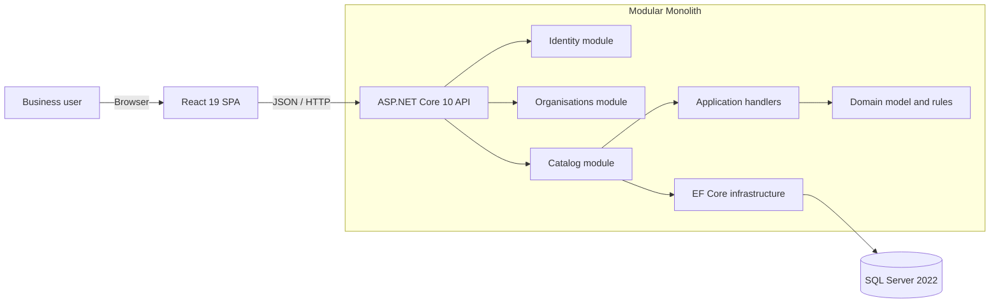

# TradeFlow

TradeFlow is a multi-organisation trade operations platform designed for New Zealand small and medium-sized businesses. It is intended to replace fragmented spreadsheet, email, and paper workflows with a consistent, auditable system for product data, purchasing, inventory, sales, invoicing, and approvals.

The repository demonstrates how I approach production-oriented software: business rules are modelled explicitly, module boundaries are enforced, concurrent updates are handled safely, and each vertical slice is delivered with API, UI, persistence, and automated tests.

> **Current delivery focus:** the Catalog module is implemented end to end. Broader purchasing, inventory, sales, invoicing, and integration capabilities are documented in the roadmap and are not presented as completed features.

## Highlights

- **Modular monolith:** clear `Identity`, `Organisations`, and `Catalog` boundaries without the operational cost of premature microservices.
- **End-to-end vertical slices:** React UI, ASP.NET Core Minimal APIs, application handlers, domain rules, EF Core persistence, and SQL Server.
- **Multi-tenant data isolation:** organisation-scoped queries and tests prevent cross-organisation access.
- **Safe concurrent editing:** SQL Server `rowversion`, Base64 API contracts, EF Core optimistic concurrency, and user-facing conflict recovery.
- **Auditable business changes:** created/modified timestamps and user identifiers are maintained by domain operations.
- **Consistent API failures:** RFC-style Problem Details responses include stable business error codes and trace IDs.
- **Operational readiness:** liveness/readiness endpoints, database health checks, locked dependencies, Docker-based local infrastructure, and GitHub Actions CI.
- **Automated quality gates:** architecture, unit, integration, API, hook, component, and page tests. The current committed revision passes **707 automated tests** (520 backend and 187 frontend).

## Implemented Features

### Product catalog

- Create products with validated reference data.
- Search and filter products by status.
- Deterministic server-side pagination.
- View complete product and audit details.
- Edit product details with optimistic concurrency control.
- Activate and deactivate products safely.
- Load active units of measure, product categories, and tax categories as reference data.

### Product categories

- Create organisation-owned categories with normalised, unique codes.
- Search, filter, and paginate category lists.
- View category details and audit information.
- Edit names and descriptions while keeping category codes immutable.
- Detect stale writes and guide users to reload the latest data.

### Platform foundation

- API liveness and SQL Server readiness checks.
- Central exception handling and Problem Details responses.
- Temporary development identity abstraction, isolated so it can be replaced by Microsoft Entra ID.
- Responsive Material UI pages with explicit loading, empty, error, and retry states.
- TanStack Query caching and invalidation after mutations.

## Architecture



The dependency direction inside a module is:

```text
Endpoints -> Application -> Domain
Infrastructure -> Application / Domain contracts
Domain -> no HTTP, database, or UI dependencies
```

The modular monolith keeps deployment simple while preserving boundaries that can support future extraction if business scale justifies it. Architecture tests verify those dependency rules.

## Technology Stack

| Area | Technology |
| --- | --- |
| Backend | C#, .NET 10 LTS, ASP.NET Core Minimal APIs |
| Persistence | Entity Framework Core 10, SQL Server 2022 |
| Frontend | React 19, JavaScript/JSX, Vite 8 |
| UI and forms | Material UI, React Hook Form, Zod |
| Server state | TanStack Query |
| Backend testing | xUnit, ASP.NET Core integration testing, architecture tests |
| Frontend testing | Vitest, Testing Library, Playwright foundation |
| Delivery | GitHub Actions, Docker Compose, locked dependencies |
| Planned production platform | Azure SQL, Microsoft Entra ID, Application Insights |

Exact versions are pinned by the repository lock files and central package management.

## Repository Structure

```text
TradeFlow/
|- backend/
|  |- src/
|  |  |- TradeFlow.Api/
|  |  |- TradeFlow.BuildingBlocks/
|  |  |- TradeFlow.Modules.Catalog/
|  |  |- TradeFlow.Modules.Identity/
|  |  `- TradeFlow.Modules.Organisations/
|  `- tests/
|     |- TradeFlow.ArchitectureTests/
|     |- TradeFlow.IntegrationTests/
|     `- TradeFlow.UnitTests/
|- frontend/
|  `- src/features/
|- deploy/local/
|- docs/
`- .github/workflows/
```

## Running Locally

### Prerequisites

- .NET SDK specified in [`global.json`](global.json)
- Node.js specified in [`.node-version`](.node-version)
- pnpm 10
- Docker Desktop or another Docker-compatible runtime

### 1. Configure the local database

From the repository root:

```powershell
Copy-Item deploy/local/.env.example deploy/local/.env
```

Replace the example SQL Server password in `deploy/local/.env` with a strong local-only password. Then store the matching application connection string in .NET User Secrets:

```powershell
dotnet user-secrets set `
  "ConnectionStrings:TradeFlowDatabase" `
  "Server=localhost,14330;Database=TradeFlow;User Id=sa;Password=<your-local-password>;TrustServerCertificate=True" `
  --project backend/src/TradeFlow.Api/TradeFlow.Api.csproj
```

Secrets and local `.env` files must not be committed.

### 2. Start SQL Server

```powershell
docker compose `
  --file deploy/local/docker-compose.yml `
  --env-file deploy/local/.env `
  up -d
```

### 3. Start the API

In a second terminal:

```powershell
dotnet run `
  --project backend/src/TradeFlow.Api/TradeFlow.Api.csproj `
  --launch-profile http
```

Useful endpoints:

- API: `http://localhost:6280`
- Liveness: `http://localhost:6280/health/live`
- Readiness: `http://localhost:6280/health/ready`
- OpenAPI document: `http://localhost:6280/openapi/v1.json`

### 4. Start the frontend

In a third terminal:

```powershell
Set-Location frontend
pnpm install --frozen-lockfile
pnpm dev
```

Open `http://localhost:6173`. Vite proxies `/api` and `/health` requests to the local API.

## Verification

Run the backend quality gates from the repository root:

```powershell
dotnet restore TradeFlow.sln --locked-mode
dotnet build TradeFlow.sln --no-restore
dotnet test TradeFlow.sln --no-build
```

Run the frontend quality gates from `frontend`:

```powershell
pnpm install --frozen-lockfile
pnpm lint
pnpm test:run
pnpm build
```

GitHub Actions runs equivalent backend and frontend pipelines for pull requests and pushes to `main`.

## Engineering Decisions Worth Reviewing

- [Architecture and decisions](docs/03-architecture/architecture-and-decisions.md) explains the modular monolith, SQL Server/Azure SQL choice, React SPA, and planned Outbox pattern.
- [API and database standards](docs/03-architecture/api-and-database-standards.md) defines endpoint, error, persistence, and data conventions.
- [Business blueprint](docs/02-business/business-blueprint.md) describes the target workflows and organisational roles.
- [Requirements and acceptance criteria](docs/02-business/requirements-and-acceptance.md) connects implementation work to verifiable business outcomes.
- [Local development guide](docs/04-engineering/local-development.md) contains the complete environment workflow.
- [Roadmap](docs/00-start-here/roadmap-zero-to-production.md) distinguishes delivered work from planned production capabilities.

## Roadmap

The project is being delivered incrementally:

1. Catalog master data and concurrency-safe workflows.
2. Purchasing requests, approvals, orders, and receiving.
3. Inventory movements, reservations, transfers, and stocktakes.
4. Sales orders, fulfilment, invoicing, and credit notes.
5. Entra ID, immutable auditing, notifications, and external integrations.
6. Azure deployment, observability, backup/restore, and operational hardening.

This sequencing keeps every completed slice demonstrable and tested while preserving a clear path toward the wider business platform.
