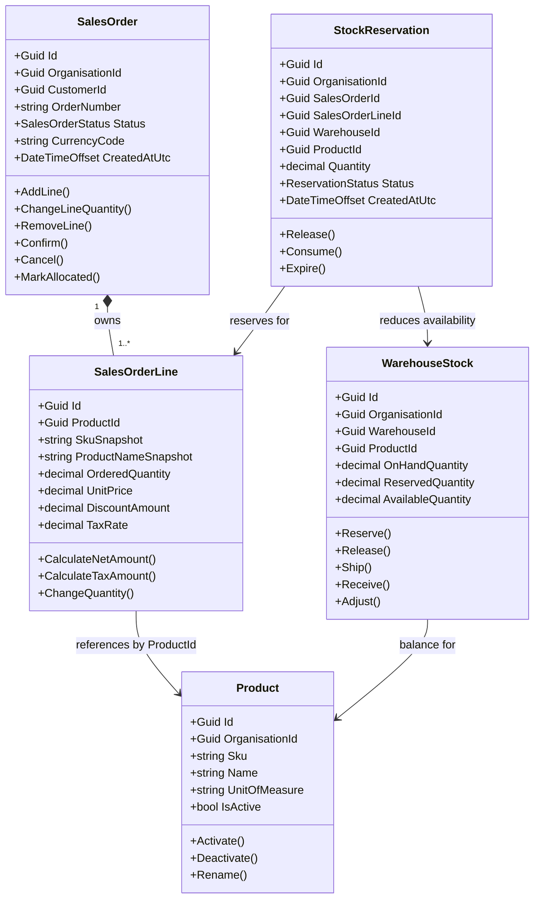

# 销售订单与库存预留：架构、实体和类说明

状态：Draft  
适用模块：Sales、Catalog、Inventory  
目标读者：第一次学习企业级 .NET 项目的开发者

## 1. 文档目的

本文详细说明以下五个核心对象：

- `SalesOrder`
- `SalesOrderLine`
- `Product`
- `WarehouseStock`
- `StockReservation`

它们共同完成一个关键业务场景：

> 销售人员确认销售订单时，系统查询真实可用库存；库存足够则创建库存预留，库存不足则拒绝确认并把明确警告返回前端。

本文不是最终代码，而是正式编码前的领域设计依据。实现、数据库Migration、API和测试都应能追踪到本文中的职责与规则。

不理解的术语可查询[企业项目专有名词词典](../00-start-here/glossary.md)。

---

## 2. 为什么不能只建立五张表做CRUD

如果只是让前端随意修改这些对象，会出现：

- 用户直接把订单状态从`Draft`改成`Shipped`。
- 两名销售人员同时卖出最后一批库存。
- 删除订单后库存预留没有释放。
- 产品改名后，历史订单显示的商品名称也被改变。
- 订单显示已确认，但预留记录没有创建。
- A企业的订单错误使用了B企业的库存。

企业系统需要把业务规则放入明确的类和事务边界，而不是让Controller、React页面或SQL脚本各自决定规则。

---

## 3. 模块所有权

五个对象不属于同一个模块。

| 对象 | 所属模块 | 原因 |
|---|---|---|
| `SalesOrder` | Sales | 负责客户订单和销售状态 |
| `SalesOrderLine` | Sales | 是销售订单聚合的一部分 |
| `Product` | Catalog | 负责SKU、名称、单位和启停状态 |
| `WarehouseStock` | Inventory | 负责仓库产品库存余额 |
| `StockReservation` | Inventory | 负责某张订单占用的库存 |

模块关系：

```text
Sales ──使用ProductId和产品快照──> Catalog
Sales ──调用库存Contract────────> Inventory
Inventory ──保存SalesOrderId来源──> Sales
```

重要规则：

- Sales模块不能直接修改`WarehouseStock`表。
- Inventory模块不能直接修改`SalesOrder`表。
- `SalesOrderLine`保存`ProductId`，但不持有或修改`Product`实体。
- 跨模块协作通过Application Contract完成。
- 跨模块对象使用ID关联，避免把所有领域对象装入一个巨大对象图。

---

## 4. 聚合边界

### SalesOrder聚合

```text
SalesOrder (Aggregate Root)
└── SalesOrderLine
```

`SalesOrder`是聚合根。外部代码不能绕过它直接增加或删除`SalesOrderLine`。

正确方式：

```csharp
order.AddLine(productSnapshot, quantity, unitPrice, taxRate);
order.ChangeLineQuantity(lineId, newQuantity);
order.RemoveLine(lineId);
```

错误方式：

```csharp
order.Lines.Add(new SalesOrderLine(...));
order.Status = SalesOrderStatus.Shipped;
```

### Inventory聚合

库存模块中有两个相关但职责不同的对象：

```text
WarehouseStock
StockReservation
```

- `WarehouseStock`维护某个仓库、某个产品的余额。
- `StockReservation`说明哪些订单占用了这些库存。

创建、释放或消费Reservation时，必须在同一事务内同步修改`WarehouseStock.ReservedQuantity`。

---

## 5. 类关系图



图中的箭头表达业务关系，不表示所有类都应该使用EF Navigation Property互相加载。

---

## 6. SalesOrder

### 6.1 业务职责

`SalesOrder`代表客户已经准备购买或确认购买的一张销售订单。

它负责：

- 维护订单基本信息。
- 管理订单明细。
- 控制订单状态变化。
- 计算订单金额。
- 防止非法编辑。
- 产生销售领域事件。

它不负责：

- 直接查询数据库。
- 直接修改产品。
- 直接发送邮件。
- 直接修改WarehouseStock。
- 直接生成React提示。

### 6.2 建议字段

| 字段 | 类型 | 说明 |
|---|---|---|
| `Id` | `Guid` | 内部主键 |
| `OrganisationId` | `Guid` | 数据所属企业 |
| `CustomerId` | `Guid` | 客户ID |
| `OrderNumber` | `string` | 企业内可读订单编号 |
| `Status` | `SalesOrderStatus` | 当前业务状态 |
| `CurrencyCode` | `string` | 如`NZD` |
| `OrderDate` | `DateOnly` | 订单业务日期 |
| `RequiredDate` | `DateOnly?` | 客户期望日期 |
| `CustomerReference` | `string?` | 客户PO或参考号 |
| `Notes` | `string?` | 受长度限制的备注 |
| `Lines` | 只读集合 | 订单明细 |
| `CreatedAtUtc` | `DateTimeOffset` | UTC创建时间 |
| `CreatedBy` | `Guid` | 创建用户 |
| `RowVersion` | `byte[]` | 持久化并发令牌 |

`RowVersion`主要是持久化关注点，可以通过private field或基础实体映射，不必成为业务方法参数。

### 6.3 状态

```csharp
public enum SalesOrderStatus
{
    Draft = 1,
    Confirmed = 2,
    Allocated = 3,
    PartiallyShipped = 4,
    Shipped = 5,
    Closed = 6,
    Cancelled = 7
}
```

允许的主要转换：

```text
Draft → Confirmed
Confirmed → Allocated
Allocated → PartiallyShipped
PartiallyShipped → Shipped
Shipped → Closed

Draft → Cancelled
Confirmed → Cancelled（必须释放预留）
Allocated → Cancelled（必须释放未消费预留）
```

### 6.4 关键不变量

```text
SAL-ORDER-001：订单必须属于一个Organisation。
SAL-ORDER-002：订单至少包含一条有效明细才能确认。
SAL-ORDER-003：只有Draft可以编辑客户、数量和价格。
SAL-ORDER-004：所有Line必须属于同一个订单。
SAL-ORDER-005：订单货币必须唯一。
SAL-ORDER-006：总金额不能小于零。
SAL-ORDER-007：状态只能通过业务方法转换。
SAL-ORDER-008：确认订单不能自动代表已经发货。
```

### 6.5 建议方法

```csharp
public sealed class SalesOrder
{
    private readonly List<SalesOrderLine> _lines = [];

    public IReadOnlyCollection<SalesOrderLine> Lines => _lines.AsReadOnly();

    public void AddLine(
        ProductSnapshot product,
        decimal quantity,
        decimal unitPrice,
        decimal discountAmount,
        decimal taxRate)
    {
        EnsureDraft();
        // 验证产品、数量、价格、折扣和税率。
        // 创建Line并加入私有集合。
    }

    public void ChangeLineQuantity(Guid lineId, decimal quantity)
    {
        EnsureDraft();
        // 查找属于本订单的Line，再由Line验证数量。
    }

    public void Confirm()
    {
        EnsureStatus(SalesOrderStatus.Draft);

        if (_lines.Count == 0)
        {
            throw new DomainException(
                "SAL_ORDER_EMPTY",
                "A sales order must contain at least one line.");
        }

        Status = SalesOrderStatus.Confirmed;
        // 添加SalesOrderConfirmed领域事件。
    }
}
```

注意：`Confirm()`只负责Sales聚合自身状态规则。调用库存模块完成预留的是Application Use Case。

---

## 7. SalesOrderLine

### 7.1 业务职责

`SalesOrderLine`代表订单中的一种产品及其数量、价格、折扣和税额。

它属于`SalesOrder`，通常不提供独立Controller：

```text
POST /sales-orders/{orderId}/lines
PUT  /sales-orders/{orderId}/lines/{lineId}
```

而不是把Line当作完全独立的顶级资源操作。

### 7.2 为什么保存产品快照

订单创建时保存：

- `ProductId`
- `SkuSnapshot`
- `ProductNameSnapshot`
- `UnitOfMeasureSnapshot`
- `TaxRate`
- `UnitPrice`

如果产品三个月后改名，历史订单仍应该显示下单时的名称与SKU。`ProductId`用于追踪，Snapshot用于保存业务历史。

### 7.3 建议字段

| 字段 | 类型 | 说明 |
|---|---|---|
| `Id` | `Guid` | 明细ID |
| `SalesOrderId` | `Guid` | 所属订单 |
| `ProductId` | `Guid` | Catalog产品引用 |
| `SkuSnapshot` | `string` | 下单时SKU |
| `ProductNameSnapshot` | `string` | 下单时名称 |
| `UnitOfMeasureSnapshot` | `string` | 下单时计量单位 |
| `OrderedQuantity` | `decimal` | 订购数量 |
| `UnitPrice` | `decimal` | 未税单价或项目统一定义的价格 |
| `DiscountAmount` | `decimal` | 折扣金额 |
| `TaxRate` | `decimal` | 下单时税率快照 |
| `ShippedQuantity` | `decimal` | 已发货数量 |

### 7.4 关键不变量

```text
SAL-LINE-001：OrderedQuantity必须大于0。
SAL-LINE-002：UnitPrice不能小于0。
SAL-LINE-003：DiscountAmount不能使NetAmount小于0。
SAL-LINE-004：TaxRate必须在允许范围内。
SAL-LINE-005：ShippedQuantity不能小于0或大于OrderedQuantity。
SAL-LINE-006：已确认订单不能通过普通编辑改变Line。
```

### 7.5 金额计算

必须在项目中统一计算和舍入位置：

```text
Gross = Quantity × UnitPrice
Net = Gross - Discount
Tax = Round(Net × TaxRate)
Total = Net + Tax
```

前端可以预览金额，但后端必须重新计算。

---

## 8. Product

### 8.1 业务职责

`Product`是Catalog模块的主数据实体，负责：

- Organisation内唯一SKU。
- 名称和描述。
- 计量单位。
- 默认税务分类。
- 启用和停用。

它不保存仓库库存数量。相同产品可以存在于多个仓库，因此库存属于`WarehouseStock`。

### 8.2 建议字段

| 字段 | 类型 | 说明 |
|---|---|---|
| `Id` | `Guid` | 产品ID |
| `OrganisationId` | `Guid` | 所属企业 |
| `Sku` | `string` | 企业内唯一 |
| `Name` | `string` | 产品名称 |
| `Description` | `string?` | 描述 |
| `UnitOfMeasure` | `string` | `Each`、`Box`等 |
| `TaxCategoryId` | `Guid` | 税务分类 |
| `IsActive` | `bool` | 是否允许新交易使用 |
| `RowVersion` | `byte[]` | 并发控制 |

### 8.3 关键不变量

```text
CAT-PROD-001：OrganisationId + SKU唯一。
CAT-PROD-002：SKU规范化后不能为空。
CAT-PROD-003：Name不能为空且有最大长度。
CAT-PROD-004：已有历史交易的产品不能直接删除。
CAT-PROD-005：停用产品不能加入新订单。
CAT-PROD-006：停用不会删除历史订单或库存流水。
```

### 8.4 ProductSnapshot

跨模块调用时，Catalog模块可以返回只读Contract：

```csharp
public sealed record ProductSnapshot(
    Guid ProductId,
    Guid OrganisationId,
    string Sku,
    string Name,
    string UnitOfMeasure,
    Guid TaxCategoryId,
    bool IsActive);
```

Sales模块依赖这个Contract，不依赖Catalog的EF Entity。

---

## 9. WarehouseStock

### 9.1 业务职责

`WarehouseStock`表示：

> 某个Organisation的某个Warehouse中，某个Product当前有多少实际库存和已预留库存。

唯一业务键：

```text
OrganisationId + WarehouseId + ProductId
```

### 9.2 建议字段

| 字段 | 类型 | 说明 |
|---|---|---|
| `Id` | `Guid` | 内部ID |
| `OrganisationId` | `Guid` | 所属企业 |
| `WarehouseId` | `Guid` | 仓库 |
| `ProductId` | `Guid` | 产品 |
| `OnHandQuantity` | `decimal` | 实际库存 |
| `ReservedQuantity` | `decimal` | 有效预留总数 |
| `RowVersion` | `byte[]` | 乐观并发控制 |

计算属性：

```csharp
public decimal AvailableQuantity =>
    OnHandQuantity - ReservedQuantity;
```

`AvailableQuantity`通常不单独保存，避免三个数字互相矛盾。

### 9.3 关键不变量

```text
INV-STOCK-001：OnHandQuantity不能低于系统允许下限。
INV-STOCK-002：ReservedQuantity不能小于0。
INV-STOCK-003：默认不允许ReservedQuantity大于OnHandQuantity。
INV-STOCK-004：跨Organisation的订单不能操作本库存。
INV-STOCK-005：每次余额变化都有Stock Transaction来源。
INV-STOCK-006：并发保存失败必须重新读取并重新验证。
```

### 9.4 建议方法

```csharp
public void Reserve(decimal quantity)
{
    EnsurePositive(quantity);

    if (AvailableQuantity < quantity)
    {
        throw new DomainException(
            "INV_STOCK_INSUFFICIENT",
            "There is not enough available stock.");
    }

    ReservedQuantity += quantity;
}

public void Release(decimal quantity)
{
    EnsurePositive(quantity);

    if (ReservedQuantity < quantity)
    {
        throw new DomainException(
            "INV_RESERVATION_RELEASE_EXCEEDS_RESERVED",
            "The release quantity exceeds reserved stock.");
    }

    ReservedQuantity -= quantity;
}

public void Ship(decimal quantity)
{
    EnsurePositive(quantity);

    if (ReservedQuantity < quantity || OnHandQuantity < quantity)
    {
        throw new DomainException(
            "INV_SHIPMENT_QUANTITY_INVALID",
            "The shipment quantity is invalid.");
    }

    ReservedQuantity -= quantity;
    OnHandQuantity -= quantity;
}
```

### 9.5 并发重点

以下普通流程存在竞态：

```text
请求A读取Available=5
请求B读取Available=5
请求A预留5
请求B也预留5
```

至少使用：

- SQL Server`rowversion`。
- 数据库事务。
- 并发失败后重新读取库存。
- 将多个Line按稳定顺序锁定或更新，降低死锁。
- 针对最后库存编写真实SQL Server并发测试。

高并发情况下可以使用带条件的原子SQL更新，但必须封装在Inventory模块中，并由集成测试证明正确。

---

## 10. StockReservation

### 10.1 业务职责

`StockReservation`保存“哪张订单的哪条Line占用了哪个仓库的多少库存”。

如果只增加`WarehouseStock.ReservedQuantity`却不创建Reservation，系统无法回答：

- 是哪些订单占用了库存？
- 取消订单时应该释放多少？
- 哪些预留已经过期？
- 发货应该消费哪条预留？

### 10.2 建议字段

| 字段 | 类型 | 说明 |
|---|---|---|
| `Id` | `Guid` | 预留ID |
| `OrganisationId` | `Guid` | 所属企业 |
| `SalesOrderId` | `Guid` | 来源订单 |
| `SalesOrderLineId` | `Guid` | 来源明细 |
| `WarehouseId` | `Guid` | 预留仓库 |
| `ProductId` | `Guid` | 产品 |
| `Quantity` | `decimal` | 预留数量 |
| `ConsumedQuantity` | `decimal` | 已用于发货的数量 |
| `Status` | `ReservationStatus` | 当前状态 |
| `CreatedAtUtc` | `DateTimeOffset` | 创建时间 |
| `ExpiresAtUtc` | `DateTimeOffset?` | 可选过期时间 |
| `ReleasedAtUtc` | `DateTimeOffset?` | 释放时间 |

### 10.3 状态

```csharp
public enum ReservationStatus
{
    Active = 1,
    PartiallyConsumed = 2,
    Consumed = 3,
    Released = 4,
    Expired = 5
}
```

### 10.4 关键不变量

```text
INV-RES-001：Quantity必须大于0。
INV-RES-002：ConsumedQuantity不能大于Quantity。
INV-RES-003：Released或Expired不能再次消费。
INV-RES-004：同一OrderLine和Warehouse不能产生重复Active预留。
INV-RES-005：预留的Organisation、Warehouse和Product必须与库存余额一致。
INV-RES-006：释放和消费必须同步更新WarehouseStock。
```

### 10.5 重复请求保护

建议唯一约束或幂等键：

```text
OrganisationId + SalesOrderLineId + WarehouseId + ActiveStatus
```

SQL Server不能简单对Enum条件建立普通唯一约束时，可以使用Filtered Unique Index或单独的Idempotency记录。

---

## 11. 数据库映射

### 11.1 表

```text
sales.SalesOrders
sales.SalesOrderLines
catalog.Products
inventory.WarehouseStocks
inventory.StockReservations
inventory.StockTransactions
audit.AuditEntries
integration.OutboxMessages
```

### 11.2 关键索引

| 表 | 索引 |
|---|---|
| `SalesOrders` | Unique `(OrganisationId, OrderNumber)` |
| `SalesOrders` | `(OrganisationId, CustomerId, Status)` |
| `SalesOrderLines` | `(SalesOrderId)` |
| `Products` | Unique `(OrganisationId, NormalizedSku)` |
| `WarehouseStocks` | Unique `(OrganisationId, WarehouseId, ProductId)` |
| `StockReservations` | `(OrganisationId, SalesOrderId, Status)` |
| `StockReservations` | `(OrganisationId, WarehouseId, ProductId, Status)` |

索引不是越多越好。实现后必须使用真实查询和执行计划验证。

### 11.3 跨模块外键

初版允许对稳定ID建立跨Schema外键以保护引用完整性，例如：

```text
sales.SalesOrderLines.ProductId → catalog.Products.Id
```

但必须遵守：

- Sales代码不通过Navigation Property修改Product。
- Catalog模块仍拥有Product生命周期。
- Migration依赖方向必须清楚。
- 如果未来拆分服务，跨模块外键需要改为Contract和最终一致性检查。

---

## 12. Application层Contract

Sales模块不应直接获取Inventory的DbContext。建议定义库存用例Contract：

```csharp
public sealed record StockReservationRequest(
    Guid SalesOrderLineId,
    Guid ProductId,
    Guid WarehouseId,
    decimal Quantity);

public interface IInventoryReservationService
{
    Task<IReadOnlyCollection<ReservationResult>> ReserveAsync(
        Guid organisationId,
        Guid salesOrderId,
        IReadOnlyCollection<StockReservationRequest> requests,
        string idempotencyKey,
        CancellationToken cancellationToken);
}
```

实现由Inventory模块提供。Contract表达业务意图，不暴露Inventory内部实体或EF查询。

在同一Azure SQL数据库的模块化单体中，确认订单用例需要通过统一事务协调器，使以下变化原子提交：

```text
SalesOrder状态
WarehouseStock余额
StockReservation记录
AuditEntry
OutboxMessage
```

任何一步失败，全部回滚。

---

## 13. 确认订单并预留库存：完整流程

### 13.1 API

```http
POST /api/v1/sales-orders/{orderId}/confirm
Idempotency-Key: 7ad4...
If-Match: "order-row-version"
```

请求：

```json
{
  "warehouseId": "84c78dd3-5e04-4b98-bbb5-b1fe5d24c9c4"
}
```

### 13.2 后端顺序

```text
1. Endpoint解析用户和Organisation
2. 检查Sales.Order.Confirm权限
3. 检查Idempotency-Key
4. 查询SalesOrder和Lines
5. 验证订单属于当前Organisation
6. 验证RowVersion和Draft状态
7. Catalog确认Product仍允许交易
8. 开始数据库事务
9. Inventory按稳定顺序查询/更新WarehouseStock
10. 每条Line验证AvailableQuantity
11. 创建StockReservation
12. 增加WarehouseStock.ReservedQuantity
13. SalesOrder.Confirm()
14. 如果全部已预留，SalesOrder.MarkAllocated()
15. 写AuditEntry
16. 写OutboxMessage
17. SaveChanges并提交事务
18. 返回确认后的订单摘要
```

产品有效性验证需要在事务前后策略明确。如果产品状态在确认瞬间也必须强一致，应将检查包含在同一数据库事务或使用并发版本验证。

### 13.3 成功响应

```json
{
  "orderId": "4cf9...",
  "orderNumber": "SO-2026-000123",
  "status": "Allocated",
  "reservations": [
    {
      "salesOrderLineId": "193b...",
      "productId": "61d3...",
      "warehouseId": "84c7...",
      "quantity": 5
    }
  ]
}
```

### 13.4 库存不足响应

```json
{
  "type": "https://tradeflow.example/problems/insufficient-stock",
  "title": "Insufficient stock",
  "status": 409,
  "code": "INV_STOCK_INSUFFICIENT",
  "detail": "One or more products no longer have enough stock.",
  "errors": {
    "lines[0].quantity": [
      "Requested 5 units of SKU-100, but only 3 are available."
    ]
  },
  "traceId": "00-abcd"
}
```

不能返回部分成功。如果订单有三条Line而第三条库存不足，前两条预留也必须回滚。

---

## 14. React前端如何处理

### 14.1 页面职责

订单页面负责：

- 展示订单和可用库存查询结果。
- 提交确认操作。
- 防止用户在请求期间重复点击。
- 显示业务警告。
- 并发冲突时提示用户刷新。
- 成功后重新获取订单和库存。

页面不负责决定最终库存是否足够。

### 14.2 TanStack Query示意

```tsx
const confirmOrder = useMutation({
  mutationFn: confirmSalesOrder,
  onSuccess: async () => {
    await queryClient.invalidateQueries({
      queryKey: ["sales-order", orderId],
    });

    await queryClient.invalidateQueries({
      queryKey: ["warehouse-stock"],
    });
  },
  onError: (problem: ApiProblem) => {
    if (problem.code === "INV_STOCK_INSUFFICIENT") {
      showWarning(problem.detail);
      return;
    }

    if (problem.code === "CONCURRENCY_CONFLICT") {
      showWarning("The order changed. Refresh and try again.");
      return;
    }

    showUnexpectedError(problem.traceId);
  },
});
```

实际实现时需要统一的`ApiProblem`类型和错误映射，不要让每个页面重复解析。

---

## 15. 需要编写的测试

### 15.1 SalesOrder单元测试

- Draft订单可以增加Line。
- 非Draft不能编辑Line。
- 空订单不能确认。
- 数量为0或负数被拒绝。
- 折扣不能使金额小于0。
- 非法状态转换被拒绝。

### 15.2 WarehouseStock单元测试

- 足够库存可以Reserve。
- 库存不足抛出稳定业务错误。
- Release不能超过Reserved。
- Ship同时减少OnHand和Reserved。
- Available始终等于OnHand减Reserved。

### 15.3 StockReservation单元测试

- Active可以部分消费。
- 全部消费后成为Consumed。
- Released不能再次消费。
- ConsumedQuantity不能超过Quantity。

### 15.4 SQL Server集成测试

- WarehouseStock唯一索引有效。
- Product SKU在Organisation内唯一。
- `rowversion`并发冲突有效。
- 订单、预留、库存和Outbox一起提交。
- 任一步失败时全部回滚。
- 两个并发确认请求只有一个成功。
- 重复Idempotency-Key不会重复预留。
- A企业订单不能使用B企业库存。

### 15.5 API测试

| 场景 | 预期 |
|---|---|
| 未登录 | 401 |
| 无确认权限 | 403 |
| 订单不存在 | 404 |
| 非Draft订单 | 409 |
| RowVersion过期 | 409 |
| 库存不足 | 409 + `INV_STOCK_INSUFFICIENT` |
| 成功 | 200 + `Allocated` |

### 15.6 Playwright测试

```text
登录
  → 打开Draft订单
  → 点击Confirm
  → 库存不足
  → 页面显示警告
  → 用户输入没有丢失
  → 补充库存后重新确认
  → 状态变为Allocated
```

---

## 16. 常见错误设计

### 错误一：Product包含StockQuantity

问题：一个产品可能存在多个仓库，无法表达仓库级库存。

正确：`Product`负责主数据，`WarehouseStock`负责仓库余额。

### 错误二：只保存ReservedQuantity

问题：不知道库存被哪些订单占用，无法可靠释放或消费。

正确：同时保存`WarehouseStock.ReservedQuantity`和明细`StockReservation`，并在同一事务维护。

### 错误三：SalesOrder直接修改库存表

问题：破坏Inventory模块所有权，库存规则散落。

正确：Sales Application调用Inventory Contract。

### 错误四：前端先检查库存，后端直接相信

问题：检查后到提交前库存可能改变，也可以绕过前端。

正确：前端只提供预览，后端事务中重新检查。

### 错误五：失败后保留部分预留

问题：订单没有确认却占用库存。

正确：所有Line预留和订单状态在一个事务中全部成功或全部回滚。

### 错误六：历史订单实时读取产品名称和价格

问题：产品修改后历史业务单据发生变化。

正确：订单Line保存业务快照。

### 错误七：捕获并发异常后直接重试SaveChanges

问题：重试前没有重新验证库存，可能破坏业务规则。

正确：重新读取最新状态、重新执行用例验证，超过次数后返回409。

---

## 17. 推荐实现顺序

不要一次写完所有类。按照以下垂直顺序实现：

1. `Product`创建、编辑、停用和唯一SKU。
2. `WarehouseStock`收货和库存流水。
3. `SalesOrder` Draft和Line管理。
4. 可用库存查询。
5. 单行订单库存预留。
6. 多行订单原子预留。
7. 并发和幂等保护。
8. 取消订单释放预留。
9. 发货消费预留。
10. 对账、监控和异常补偿。

每一步都需要：

```text
业务规则
  → Domain
  → Migration
  → Application
  → API
  → React
  → Tests
  → Pull Request
```

---

## 18. 设计完成检查清单

- [ ] 每个类的模块Owner明确。
- [ ] SalesOrder是聚合根，Line不能被绕过修改。
- [ ] Product不保存仓库库存。
- [ ] Product Snapshot保留历史订单信息。
- [ ] WarehouseStock有唯一业务键和`rowversion`。
- [ ] Reservation能够追踪订单、Line、仓库和产品。
- [ ] 库存余额与Reservation在同一事务更新。
- [ ] 所有查询包含Organisation隔离。
- [ ] 错误使用稳定Code和正确HTTP状态。
- [ ] React不作为最终业务验证者。
- [ ] 并发、幂等和回滚有真实SQL Server测试。
- [ ] 审计、Outbox、日志和Trace在流程中有明确位置。
